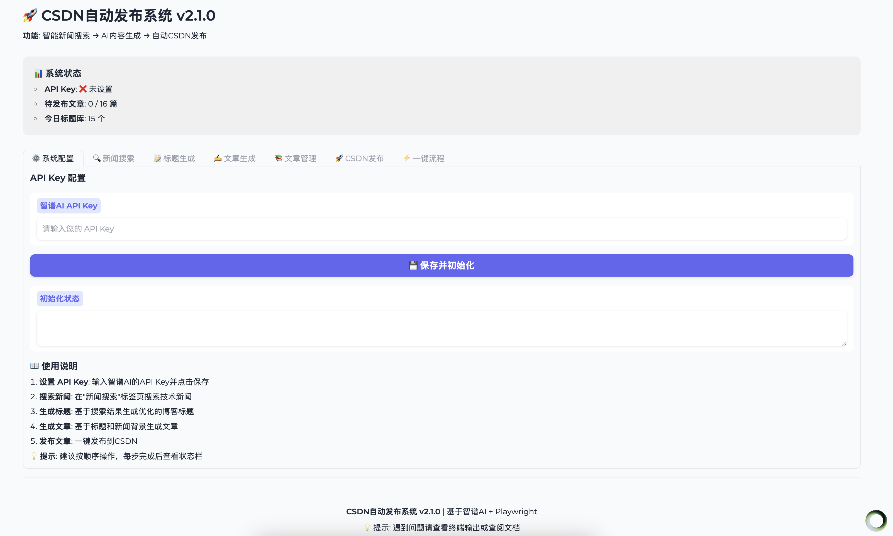

# 🤖 CSDN 自动化博客发布系统# 🤖 CSDN 自动化博客发布系统


[](https://www.python.org/downloads/)[](https://www.python.org/downloads/)

[](https://opensource.org/licenses/MIT)[](https://opensource.org/licenses/MIT)

[](https://playwright.dev/)[](https://playwright.dev/)

[](https://bigmodel.cn/)[](https://bigmodel.cn/)


> 🚀 一个完整的自动化技术博客发布系统，集成智谱AI自动生成内容，并批量发布到CSDN编辑器。> 🚀 一个完整的自动化技术博客发布系统，集成智谱AI自动生成内容，并批量发布到CSDN编辑器。


## 📋 目录## 📋 目录


- [特性](#-特性)- [特性](#-特性)

- [演示](#-演示)- [演示](#-演示)

- [快速开始](#-快速开始)- [快速开始](#-快速开始)

- [安装](#-安装)- [安装](#-安装)

- [配置](#-配置)- [配置](#-配置)

- [使用方法](#-使用方法)- [使用方法](#-使用方法)

- [项目结构](#-项目结构)- [项目结构](#-项目结构)

- [API参考](#-api参考)- [API参考](#-api参考)

- [常见问题](#-常见问题)- [常见问题](#-常见问题)

- [贡献](#-贡献)- [贡献](#-贡献)

- [许可证](#-许可证)- [许可证](#-许可证)


## ✨ 特性## ✨ 特性


### 🆕 每日自动化内容生成（v2.1.0）### 🆕 每日自动化内容生成（v2.1.0）

- **🔍 智能新闻搜索**：基于智谱Web Search API，自动搜索前一天的技术新闻- **🔍 智能新闻搜索**：基于智谱Web Search API，自动搜索前一天的技术新闻

- **📊 自动提炼信息**：从大模型、AI、智能体等15个领域提取关键动态- **📊 自动提炼信息**：从大模型、AI、智能体等15个领域提取关键动态

- **✍️ 智能文章生成**：基于真实新闻背景生成15篇高质量技术博客- **✍️ 智能文章生成**：基于真实新闻背景生成15篇高质量技术博客

- **⚡ 完全自动化**：无需手动输入关键词，实现一键生成- **⚡ 完全自动化**：无需手动输入关键词，实现一键生成


### 🎯 核心功能### 🎯 核心功能

- **📝 自动内容生成**：基于关键词或最新技术趋势，自动生成博客标题和文章- **📝 自动内容生成**：基于关键词或最新技术趋势，自动生成博客标题和文章

- **🔄 批量处理**：自动处理 `posts/` 目录中的所有Markdown文件- **🔄 批量处理**：自动处理 `posts/` 目录中的所有Markdown文件

- **🔐 登录持久化**：`storage.json` 保存登录状态，避免重复扫码- **🔐 登录持久化**：`storage.json` 保存登录状态，避免重复扫码

- **🎨 智能发布**：自动填充标题、正文、标签，一键发布- **🎨 智能发布**：自动填充标题、正文、标签，一键发布

- **💪 健壮性强**：多重选择器回退，适配CSDN页面变化- **💪 健壮性强**：多重选择器回退，适配CSDN页面变化

- **🎛️ 可视化界面**：基于Gradio的现代化Web UI- **🎛️ 可视化界面**：基于Gradio的现代化Web UI


## 🎬 演示## 🎬 演示


### 📸 界面截图### 📸 界面截图




### 🎥 演示视频### 🎥 演示视频

[](https://youtu.be/zIV37UPfz4Q)[](https://youtu.be/zIV37UPfz4Q)


**[🎬 观看完整演示视频](https://youtu.be/zIV37UPfz4Q)****[🎬 观看完整演示视频](https://youtu.be/zIV37UPfz4Q)**


## 🚀 快速开始## 🚀 快速开始


### 📋 前置条件### 📋 前置条件


- Python 3.8+- Python 3.8+

- CSDN账号- CSDN账号

- 智谱AI API Key- 智谱AI API Key


### ⚡ 一键启动### ⚡ 一键启动


```bash```bash

# 1. 克隆仓库```

git clone https://github.com/yourusername/csdn-blog-auto-publish.git

cd csdn-blog-auto-publish### 3. 安装Playwright浏览器


# 2. 安装依赖```bash

pip install -r requirements.txtplaywright install chromium

```

# 3. 设置API Key

export ZHIPUAI_API_KEY="your_api_key_here"## ⚙️ 配置


# 4. 启动Web界面### 1. 智谱AI API配置

python ui.py

```获取API Key：[智谱AI开放平台](https://bigmodel.cn/)


访问 `http://localhost:7860` 开始使用！```bash

# 方法1: 环境变量（推荐）

## 🔧 安装export ZHIPUAI_API_KEY="your_api_key_here"


### 1. 创建虚拟环境（推荐）# 方法2: 在Web界面中输入

```

```bash

python3 -m venv .venv### 2. 关键词配置

source .venv/bin/activate  # Windows: .venv\Scripts\activate

```编辑 `keywords.txt` 文件，每行一个关键词：


### 2. 安装依赖```

Python

```bash机器学习

pip install -r requirements.txt深度学习

```人工智能

大模型

### 3. 安装Playwright浏览器# ... 更多关键词

```

```bash

playwright install chromium### 3. CSDN登录

```

首次使用时，系统会自动打开CSDN登录页面进行扫码登录，登录状态会保存在 `storage.json` 中。

## ⚙️ 配置

## 📖 使用方法

### 1. 智谱AI API配置

### 🎨 Web界面（推荐）

获取API Key：[智谱AI开放平台](https://bigmodel.cn/)

```bash

```bashpython ui.py

# 方法1: 环境变量（推荐）```

export ZHIPUAI_API_KEY="your_api_key_here"

提供完整的图形化操作界面，支持：

# 方法2: 在Web界面中输入- API Key管理

```- 新闻搜索和内容生成

- 文章预览和编辑

### 2. 关键词配置- 批量发布管理


编辑 `keywords.txt` 文件，每行一个关键词：### 💻 命令行模式


```#### 每日自动生成

Python

机器学习```bash

深度学习# 自动搜索昨日新闻并生成文章

人工智能python auto_generate_daily.py

大模型

# ... 更多关键词# 或使用快捷脚本

```./start.sh

```

### 3. CSDN登录

#### 手动内容生成

首次使用时，系统会自动打开CSDN登录页面进行扫码登录，登录状态会保存在 `storage.json` 中。

```bash

## 📖 使用方法# 基于关键词生成内容

python auto_generate.py

### 🎨 Web界面（推荐）

# 发布已生成的文章

```bashpython publish_csdn.py

python ui.py```

```

#### 批量发布

提供完整的图形化操作界面，支持：

- API Key管理```bash

- 新闻搜索和内容生成```

- 文章预览和编辑

- 批量发布管理访问 `http://localhost:7860` 开始使用！


### 💻 命令行模式## 🔧 安装


#### 每日自动生成### 1. 创建虚拟环境（推荐）


```bash```bash

# 自动搜索昨日新闻并生成文章python3 -m venv .venv

python auto_generate_daily.pysource .venv/bin/activate  # Windows: .venv\Scripts\activate

```

# 或使用快捷脚本

./start.sh### 2. 安装依赖

```

```bash

#### 手动内容生成pip install -r requirements.txt


```bash# 安装Playwright浏览器

# 基于关键词生成内容python -m playwright install

python auto_generate.py```


# 发布已生成的文章### 2. 配置智谱AI

python publish_csdn.py

```获取智谱AI API Key：https://open.bigmodel.cn/


#### 批量发布设置环境变量：

```bash

```bash# Linux/Mac

# 发布posts目录下的所有文章export ZHIPUAI_API_KEY="your-api-key-here"

python publish_csdn.py

# Windows PowerShell

# 发布指定文章$env:ZHIPUAI_API_KEY="your-api-key-here"

python publish_csdn.py --file "posts/specific_article.md"

```# 或者写入 ~/.bashrc 或 ~/.zshrc 永久保存

echo 'export ZHIPUAI_API_KEY="your-api-key-here"' >> ~/.zshrc

## 📁 项目结构source ~/.zshrc

```

```

csdn-blog-auto-publish/### 3. 配置关键词（可选）

├── 📄 README.md                    # 项目说明文档

├── 🔧 requirements.txt             # Python依赖包编辑 `keywords.txt` 文件，每行一个关键词：

├── 🔑 storage.json                 # 登录状态存储```

├── 📝 keywords.txt                 # 内容生成关键词人工智能

│vllm

├── 🚀 核心脚本大模型训练

│   ├── ui.py                       # Web界面主程序云原生

│   ├── auto_generate_daily.py      # 每日自动生成脚本```

│   ├── auto_generate.py            # 手动内容生成脚本

│   ├── publish_csdn.py             # CSDN发布脚本## 使用方法

│   ├── zhipu_news_search.py        # 智谱新闻搜索模块

│   ├── zhipu_content_generator.py  # 智谱内容生成模块### 🆕 方式一：每日自动生成（推荐 - v2.1.0）

│   └── clean_articles.py           # 文章清理工具

│#### 完全自动化的每日博客生成

├── 📚 文档

│   └── docs/```bash

│       └── DAILY_AUTO_GENERATE.md  # 每日自动生成教程# 一键生成：搜索昨天的新闻，生成15篇文章

│python auto_generate_daily.py

├── 🧪 测试

│   └── tests/# 使用一键启动脚本

│       ├── test_clean_markdown.py  # Markdown清理测试./start.sh  # 选择选项 5

│       ├── test_news_search.py     # 新闻搜索测试```

│       ├── test_system.py          # 系统测试

│       └── test_ui.py              # UI测试**自动完成**：

│1. 搜索昨天的大模型、AI、智能体等领域新闻

├── 📊 数据目录2. 提取15条关键技术动态

│   ├── posts/                      # 待发布文章（最多16篇）3. 生成15个优化的博客标题

│   ├── todo/                       # 标题和新闻存储4. 基于新闻背景生成高质量文章

│   ├── imgs/                       # 项目截图5. 保存到 posts/ 目录

│   └── videos/                     # 演示视频

│#### 分步执行

└── 🔧 工具脚本

    ├── start.sh                    # 快速启动脚本```bash

    ├── start_ui.sh                 # UI启动脚本# 步骤1：搜索新闻和生成标题

    ├── demo.py                     # 演示脚本python auto_generate_daily.py --search-only

    └── demo_daily_generate.py      # 每日生成演示

```# 步骤2：从已有标题生成文章（可分批）

python auto_generate_daily.py --from-existing --articles 5

## 🔌 API参考```


### 核心类#### 自定义选项


#### `ZhipuNewsSearcher````bash

```python# 搜索最近3天的新闻

from zhipu_news_search import ZhipuNewsSearcherpython auto_generate_daily.py --days 3


searcher = ZhipuNewsSearcher(api_key)# 指定搜索主题

results = searcher.search_yesterday_news()python auto_generate_daily.py --topics "大模型" "AGI" "多模态AI"

```

# 生成10篇文章

#### `ZhipuContentGenerator`python auto_generate_daily.py --count 10 --articles 10

```python```

from zhipu_content_generator import ZhipuContentGenerator

**详细文档**：查看 [DAILY_AUTO_GENERATE.md](DAILY_AUTO_GENERATE.md)

generator = ZhipuContentGenerator(api_key)

titles = generator.generate_titles_from_news(news_data)---

article = generator.generate_article(title, context)

```### 方式二：基于关键词生成（v2.0.0）


### 配置选项#### 步骤1：生成内容


| 参数 | 描述 | 默认值 |```bash

|------|------|--------|# 1. 生成10个标题（保存到todo目录）和1篇示例文章（保存到posts目录）

| `POSTS_LIMIT` | posts目录文章数量限制 | 16 |python auto_generate.py

| `ZHIPUAI_API_KEY` | 智谱AI API密钥 | 环境变量 |

| `SEARCH_DOMAINS` | 新闻搜索领域数量 | 15 |# 2. 使用指定关键词生成

python auto_generate.py --keyword "人工智能"

## ❓ 常见问题

# 3. 生成指定数量的文章（会检查posts目录限制）

<details>python auto_generate.py --generate-articles 5

<summary><strong>Q: 如何获取智谱AI API Key？</strong></summary>

# 4. 只生成标题，不生成文章

1. 访问 [智谱AI开放平台](https://bigmodel.cn/)python auto_generate.py --titles-only --count 15

2. 注册并登录账号

3. 在控制台创建API Key# 5. 从todo目录的标题生成3篇文章

4. 复制密钥并设置环境变量python auto_generate.py --generate-articles 3

</details>```


<details>**命令参数说明：**

<summary><strong>Q: 发布失败怎么办？</strong></summary>- `--keyword`：指定关键词（不指定则从keywords.txt读取或使用最新趋势）

- `--count`：生成标题数量（默认10个）

1. 检查网络连接和CSDN状态- `--titles-only`：只生成标题，不生成文章

2. 确认登录状态是否过期- `--generate-articles N`：生成N篇文章（自动检查posts限制）

3. 删除 `storage.json` 重新登录- `--posts-limit`：posts目录文章数量限制（默认16篇）

4. 查看控制台错误日志

</details>#### 步骤2：发布到CSDN


<details>```bash

<summary><strong>Q: 生成的文章质量不高？</strong></summary># 首次运行需要登录（默认非无头模式）

python publish_csdn.py --headless false

1. 优化 `keywords.txt` 中的关键词

2. 调整文章生成的提示词# 后续运行会自动使用保存的登录状态

3. 增加新闻搜索的时间范围python publish_csdn.py

4. 手动审查和编辑生成的内容```

</details>

### 方式二：手动创建文章后发布

<details>

<summary><strong>Q: 如何自定义文章生成逻辑？</strong></summary>1. 将Markdown文件放入 `posts/` 目录

2. 运行发布脚本：

编辑 `zhipu_content_generator.py` 文件中的提示词模板：```bash

- `TITLE_GENERATION_PROMPT`: 标题生成提示python publish_csdn.py

- `ARTICLE_GENERATION_PROMPT`: 文章生成提示```

</details>

### 方式三：高级用法

## 🤝 贡献

```bash

我们欢迎各种形式的贡献！# 生成5个标题并立即生成3篇文章

python auto_generate.py --count 5 --generate-articles 3

### 如何贡献

# 修改posts目录限制为20篇

1. Fork 这个仓库python auto_generate.py --generate-articles 5 --posts-limit 20

2. 创建特性分支 (`git checkout -b feature/AmazingFeature`)

3. 提交更改 (`git commit -m 'Add some AmazingFeature'`)# 指定自定义关键词文件

4. 推送到分支 (`git push origin feature/AmazingFeature`)python auto_generate.py --keywords-file my_keywords.txt

5. 创建 Pull Request

# 发布时跳过自动点击发布按钮（调试用）

### 开发指南python publish_csdn.py --skip-publish


```bash# 设置登录超时时间为3分钟

# 运行测试python publish_csdn.py --login-timeout 180

python -m pytest tests/```


# 代码格式化## 工作流程

black .

isort .### 完整自动化流程


# 类型检查```

mypy .1. 读取关键词 (keywords.txt)

```   ↓

2. 调用智谱AI生成10个标题

## 🔄 更新日志   ↓

3. 保存标题到 todo/YYYYMMDD_titles.txt

### v2.1.0 (2024-10-31)   ↓

- ✨ 新增每日自动化内容生成功能4. 选择标题生成文章（Markdown格式）

- 🔍 集成智谱Web Search API   ↓

- 📊 添加15个技术领域的新闻监控5. 保存文章到 posts/ 目录（最多16篇）

- 🎨 优化Web界面和用户体验   ↓

6. 运行发布脚本

### v2.0.0 (2024-10-30)   ↓

- 🎛️ 新增Gradio Web界面7. 自动登录CSDN（首次需要扫码，后续自动）

- 🤖 集成智谱AI自动生成内容   ↓

- 📝 支持批量文章生成和发布8. 批量发布文章（每篇间隔30秒）

- 💾 添加登录状态持久化   ↓

9. 完成

### v1.0.0 (2024-10-25)```

- 🚀 基础CSDN自动发布功能

- 📁 支持批量Markdown文件处理## Markdown文章格式

- 🔧 Playwright浏览器自动化

### 方式1：使用YAML Front Matter（推荐）

## 📄 许可证

```markdown

本项目基于 MIT 许可证开源 - 查看 [LICENSE](LICENSE) 文件了解详情。---

title: 文章标题

## 🙏 致谢tags: [人工智能, 深度学习]

---

- [智谱AI](https://bigmodel.cn/) - 提供强大的AI能力

- [Playwright](https://playwright.dev/) - 现代化的浏览器自动化## 引言

- [Gradio](https://gradio.app/) - 简单易用的Web界面框架

- [CSDN](https://www.csdn.net/) - 技术博客平台这里是文章内容...


## 📞 联系方式## 主要内容


- 📧 Email: [your-email@example.com](mailto:your-email@example.com)...

- 🐛 Issues: [GitHub Issues](https://github.com/yourusername/csdn-blog-auto-publish/issues)```

- 💬 Discussions: [GitHub Discussions](https://github.com/yourusername/csdn-blog-auto-publish/discussions)

### 方式2：纯Markdown

---

```markdown

<div align="center"># 文章标题


**⭐ 如果这个项目对你有帮助，请给它一个星标！**## 引言


[🚀 开始使用](#-快速开始) • [📚 查看文档](docs/) • [🎬 观看演示](https://youtu.be/zIV37UPfz4Q)这里是文章内容...

```

</div>
## 常见问题

### 1. 智谱AI相关

**Q: API调用失败怎么办？**
```bash
# 检查API Key是否设置
echo $ZHIPUAI_API_KEY

# 测试API连接
python -c "from zhipuai import ZhipuAI; client = ZhipuAI(); print('API连接成功')"
```

**Q: 如何查看API调用额度？**
访问：https://open.bigmodel.cn/usercenter/apikeys

**Q: 生成的文章质量不满意？**
- 修改 `zhipu_content_generator.py` 中的prompt提示词
- 调整 `temperature` 参数（0.5-0.9之间）
- 使用更具体的关键词

### 2. 发布相关

**Q: posts目录已满怎么办？**
```bash
# 查看当前文章数
ls -l posts/*.md | wc -l

# 方法1：发布后会自动清理
python publish_csdn.py

# 方法2：手动移动到备份目录
mkdir -p backup
mv posts/*.md backup/

# 方法3：修改限制（不推荐超过20篇）
python auto_generate.py --posts-limit 20
```

**Q: 每次都要登录？**
- 确认 `storage.json` 文件存在
- 如果损坏，删除后重新登录：`rm storage.json`

**Q: 发布按钮点不到？**
- CSDN页面结构可能变化，脚本会尝试多种选择器
- 可以使用 `--skip-publish` 调试，手动完成最后步骤

**Q: 中文输入异常？**
- 脚本优先使用编辑器API，失败时会回退到剪贴板
- 确保浏览器有剪贴板权限

### 3. 内容生成相关

**Q: 如何批量生成多篇文章？**
```bash
# 一次生成5篇
python auto_generate.py --generate-articles 5

# 如果posts已有文章，会自动检查剩余空间
```

**Q: 如何使用todo目录的标题？**
```bash
# 标题会自动保存到 todo/YYYYMMDD_titles.txt
# 下次生成文章时会优先使用今天的标题
python auto_generate.py --generate-articles 3
```

**Q: 如何自定义生成的内容？**
编辑 `zhipu_content_generator.py`，修改：
- `generate_titles()` - 标题生成prompt
- `generate_article()` - 文章生成prompt

## 高级配置

### 自定义模型参数

编辑 `zhipu_content_generator.py`：

```python
# 标题生成 - 使用快速模型
model="glm-4-flash"      # 可选: glm-4, glm-4-plus
temperature=0.8          # 0.0-1.0, 越高越有创意

# 文章生成 - 使用强大模型
model="glm-4-plus"       # 可选: glm-4, glm-4-flash
temperature=0.7          # 0.0-1.0, 平衡质量和创意
max_tokens=8000          # 最大输出长度
```

### 修改每日发布限制

```python
# 在 auto_generate.py 中修改默认值
parser.add_argument(
    "--posts-limit",
    type=int,
    default=16,  # 改为你想要的数量
    help="posts目录文章数量限制"
)
```

### 自定义文章模板

编辑 `zhipu_content_generator.py` 的 `generate_article()` 方法中的prompt。

## 安全提示

⚠️ **重要**：
- 不要将 `storage.json`（包含登录信息）提交到公共仓库
- 不要泄露智谱AI的API Key
- 建议将敏感文件加入 `.gitignore`

```bash
# .gitignore 示例
storage.json
.env
*.pyc
__pycache__/
.venv/
```

## 性能优化

### 减少API调用成本

```bash
# 1. 先生成标题（便宜）
python auto_generate.py --titles-only --count 20

# 2. 需要时再生成文章（较贵）
python auto_generate.py --generate-articles 3

# 3. 使用更便宜的模型
# 编辑 zhipu_content_generator.py
# 将 glm-4-plus 改为 glm-4-flash
```

### 批量发布优化

```bash
# 发布时的等待时间（避免被CSDN限流）
# 在 publish_csdn.py 中，每篇文章发布后等待30秒
time.sleep(30)  # 可根据需要调整
```

## 贡献指南

欢迎提交Issue和Pull Request！

改进方向：
- [ ] 支持更多博客平台（掘金、博客园等）
- [ ] 添加文章质量评估
- [ ] 支持封面图自动生成
- [ ] 添加发布统计和报告
- [ ] 支持定时发布

## 许可证

MIT License

## 更新日志

### v2.0.0 (2025-10-28)
- ✨ 新增智谱AI自动内容生成功能
- ✨ 新增标题批量生成（基于关键词或最新趋势）
- ✨ 新增文章自动写作功能
- ✨ 新增posts目录容量管理（最多16篇）
- ✨ 新增todo目录标题存储
- 🔧 优化命令行参数和使用体验

### v1.0.0
- 基础CSDN自动发布功能
- 登录状态持久化
- 批量文章处理

## 联系方式

如有问题，请提交Issue或联系项目维护者。
