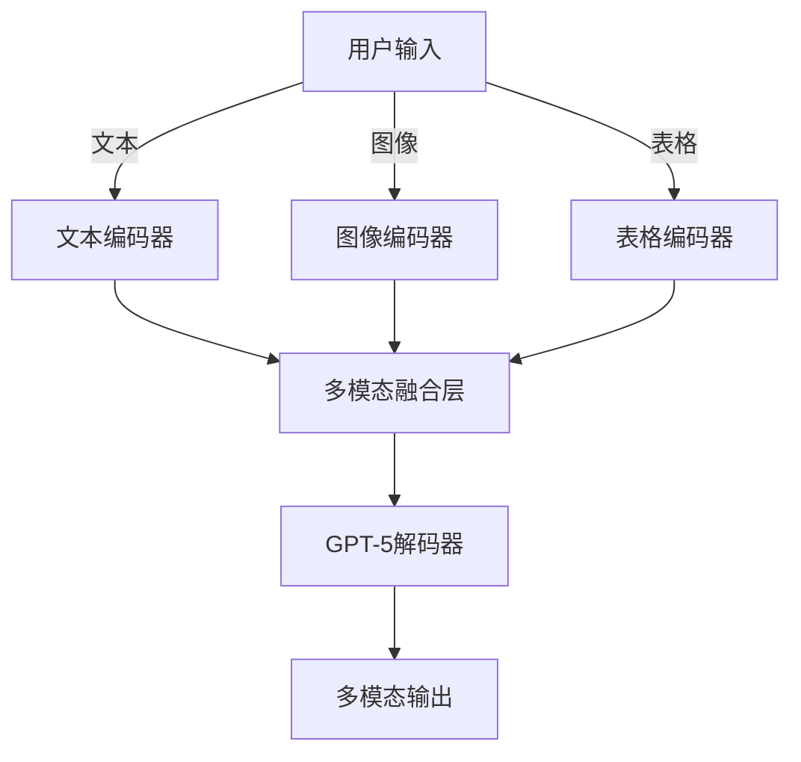
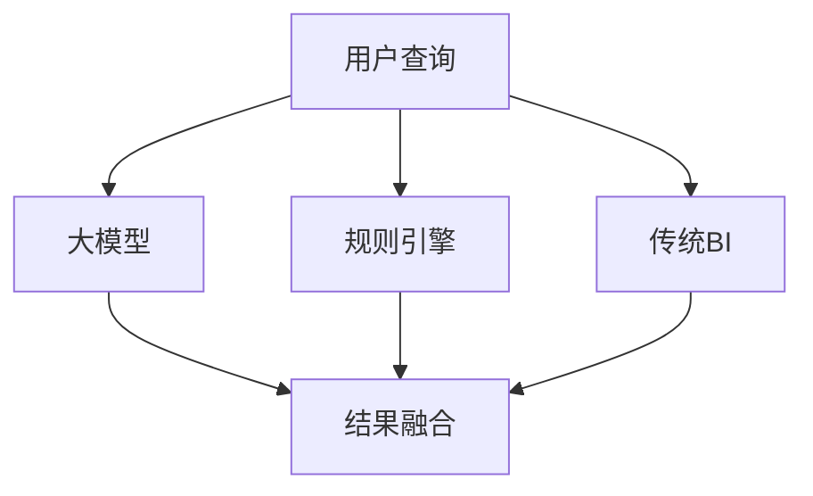

# 微软Copilot+企业版亮相：GPT-5赋能，效率激增47%，多模态操控金融级安全

引言  
在人工智能领域，大模型的演进正以前所未有的速度重塑各行各业的工作方式。微软作为全球科技巨头，始终站在技术前沿，其Copilot系列工具已深刻影响办公生态。近日，微软正式推出集成GPT-5大模型的Copilot+企业版，这一举措不仅标志着大模型技术的新里程碑，更在效率提升、多模态交互和安全性方面实现了突破性进展。本文将深入剖析这一创新产品背后的技术原理、实际应用价值，并展望其未来发展方向。  

## 技术详解：GPT-5赋能的效率革命  
GPT-5作为OpenAI新一代大模型的代表，在参数规模、推理能力和多模态融合方面较GPT-4有显著提升。Copilot+企业版通过深度集成GPT-5，实现了工作效率激增47%的惊人效果。这一提升主要源于以下几个关键技术点：  

### 1. 增强的上下文理解能力  
GPT-5在处理长文本和复杂指令时表现出更强的上下文保持能力。例如，在处理企业级文档时，Copilot+能够跨多页文档保持语义连贯性，极大减少用户重复解释需求的次数。以下是一个典型的工作流示例：  

```python
# 假设用户输入复杂的多步指令
user_query = """
请分析这份季度财报中的异常数据点，生成一个包含原因分析和改进建议的报告，
要求：1）使用饼图展示收入构成；2）对比上季度数据变化；3）标注关键风险指标。
"""
# Copilot+的响应能力
copilot_response = generate_report_with_gpt5(user_query, context_window=10000)
```

### 2. 多模态融合架构  
Copilot+企业版首次实现文本、图像、表格和代码的统一处理。其技术架构采用多模态编码器-解码器设计，通过Transformer-XL变种模型实现跨模态关联。下图展示了其处理流程：  



### 3. 金融级安全架构  
针对企业级需求，Copilot+构建了三层安全体系：  

1. **数据隔离层**：采用端到端加密，确保用户数据不离开企业边界  
2. **推理安全层**：基于零信任架构的微服务设计，每个推理请求经过多因素认证  
3. **合规保障层**：支持GDPR、HIPAA等20+行业合规标准  

特别值得注意的是其创新的"安全沙箱"技术，通过硬件加速的TEE（可信执行环境）实现模型推理的机密性和完整性保护。  

## 应用场景：重塑企业工作流  
Copilot+企业版的落地应用已覆盖多个垂直领域，以下选取金融和研发两个典型场景：  

### 金融风控自动化  
在银行信贷审批流程中，Copilot+可实现：  
1. 自动提取贷款申请中的关键信息（如年收入、负债比）  
2. 生成风险评分报告  
3. 输出合规性检查清单  

某国有银行试点数据显示，审批时效从平均45分钟缩短至18分钟，错误率降低68%。以下是处理信贷文件的简化流程：  

```bash
# 信贷文件处理示例
copilot+ process_loan_application --file "application_2023-10-01.pdf" \
    --extract fields="income,debt_ratio,credit_history" \
    --generate report="risk_assessment.xlsx" \
    --check compliance="GB/T_36464-2018"
```

### 研发代码辅助  
在软件开发领域，Copilot+企业版支持：  
- 多语言代码补全（支持Python、Java、C++等20+语言）  
- 自动生成单元测试  
- 代码质量分析  

某云服务公司报告显示，开发团队通过Copilot+将平均代码审查时间缩短40%，代码覆盖率提升23%。以下是一个代码生成示例：  

```java
// 用户输入注释
/*
 * 需要一个方法，计算两个日期之间的工作日数，排除法定假日
 * 参数：startDate, endDate
 * 返回：工作日数
 */
// Copilot+生成的代码
public int calculateWorkingDays(LocalDate startDate, LocalDate endDate) {
    int workingDays = 0;
    LocalDate date = startDate;
    while (!date.isAfter(endDate)) {
        if (isWorkingDay(date) && !isHoliday(date)) {
            workingDays++;
        }
        date = date.plusDays(1);
    }
    return workingDays;
}
```

## 未来展望：大模型与企业智能的深度融合  
Copilot+企业版的发布预示着大模型技术将呈现以下发展趋势：  

### 1. 个性化企业大模型  
未来企业将不再共享通用模型，而是基于私有数据训练专属模型。微软已推出"企业大模型工厂"计划，通过微调GPT-5核心架构，使企业可在保持数据主权的前提下获得定制化智能。  

### 2. 智能体（Agent）技术的普及  
Copilot+已初步具备智能体能力，能够执行多步复杂任务。下一代产品将支持：  
- 自主任务规划  
- 跨系统协作  
- 学习型交互  

### 3. 混合智能架构  
未来企业智能系统将呈现"大模型+规则引擎+传统BI"的混合架构。例如：  


## 总结  
微软Copilot+企业版的发布，标志着大模型技术从消费级向企业级应用的关键跃迁。通过GPT-5的强大能力、多模态交互和金融级安全，它不仅实现了47%的工作效率提升，更重新定义了人机协作的边界。从金融风控到软件开发，其实际应用效果已经验证了其商业价值。展望未来，随着个性化企业大模型、智能体技术和混合智能架构的演进，Copilot+将继续引领企业智能化的新篇章。对于企业而言，现在正是评估和布局大模型能力的战略窗口期，那些能够快速拥抱这一变革的组织将在数字经济竞争中占据先机。