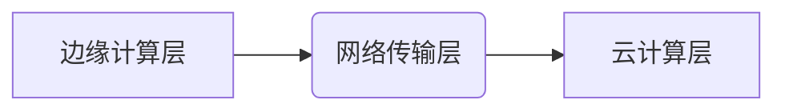

# 联想AI工厂新范式：全栈算力赋能城市智能体规模化应用探秘

## 引言

在2025世界数字城市大会上，联想重磅推出了全栈算力产品，并提出了AI工厂新范式，这一创新举措无疑为城市智能体的规模化应用注入了强大动力。随着城市化进程的加速和智能技术的迅猛发展，城市智能体作为连接物理世界与数字世界的桥梁，正逐渐成为智慧城市建设的关键支撑。联想的这一全新范式，不仅是对现有技术的突破，更是对未来城市智能体发展的深远布局。

## 技术详解

### 全栈算力架构

联想的全栈算力产品涵盖了从边缘计算到云计算的全方位算力解决方案。其核心架构包括：

1. **边缘计算层**：通过部署在终端设备的边缘计算节点，实现数据的实时处理和分析。
2. **云计算层**：利用高性能服务器和数据中心，提供强大的后台计算支持。
3. **网络传输层**：通过高速、低延迟的网络连接，确保数据在不同层级之间的高效传输。



### AI工厂新范式

AI工厂新范式是联想在此次大会上提出的一大亮点。其核心思想是将AI模型的开发、训练、部署和维护全过程实现工厂化、自动化管理。具体包括：

- **模型开发自动化**：利用自动化工具和平台，简化模型开发流程。
- **模型训练高效化**：通过分布式计算和优化算法，提升模型训练效率。
- **模型部署标准化**：制定统一的部署标准，确保模型在不同环境下的稳定运行。
- **模型维护智能化**：利用AI技术对模型进行实时监控和优化，延长模型生命周期。

```python
# 示例：自动化模型训练代码
from sklearn.automl import AutoML

automl = AutoML()
automl.fit(X_train, y_train)
best_model = automl.best_estimator_
```

## 应用场景

### 智慧交通

在智慧交通领域，联想的全栈算力产品和AI工厂新范式可以大幅提升交通管理的智能化水平。通过在交通路口部署边缘计算节点，实时分析交通流量数据，优化信号灯控制，减少交通拥堵。

```json
{
  "intersection_id": "001",
  "traffic_flow": {
    "north": 120,
    "south": 90,
    "east": 80,
    "west": 100
  },
  "signal_timing": {
    "green": 30,
    "yellow": 5,
    "red": 25
  }
}
```

### 智慧医疗

在智慧医疗领域，AI工厂新范式可以加速医疗影像分析模型的开发和应用。通过自动化工具快速训练出高精度的影像识别模型，帮助医生更准确、高效地进行诊断。

```python
# 示例：医疗影像分析模型训练
import tensorflow as tf

model = tf.keras.models.Sequential([
    tf.keras.layers.Conv2D(32, (3, 3), activation='relu', input_shape=(256, 256, 3)),
    tf.keras.layers.MaxPooling2D((2, 2)),
    tf.keras.layers.Conv2D(64, (3, 3), activation='relu'),
    tf.keras.layers.MaxPooling2D((2, 2)),
    tf.keras.layers.Flatten(),
    tf.keras.layers.Dense(64, activation='relu'),
    tf.keras.layers.Dense(1, activation='sigmoid')
])

model.compile(optimizer='adam', loss='binary_crossentropy', metrics=['accuracy'])
model.fit(X_train, y_train, epochs=10)
```

### 智慧城市治理

在城市治理领域，联想的全栈算力产品可以实现对城市各类数据的全面感知和分析。通过AI工厂新范式，快速开发和应用各类城市管理模型，提升城市治理的精细化水平。

```yaml
- sensor_id: "sensor_001"
  location: "Central Park"
  data_type: "environmental"
  readings:
    temperature: 22.5
    humidity: 60
    pollution_level: 30
```

## 未来展望

### 技术融合与创新

未来，联想的全栈算力产品和AI工厂新范式将进一步与物联网、大数据、区块链等前沿技术深度融合，推动城市智能体技术的不断创新和发展。

### 规模化应用与普及

随着技术的不断成熟和成本的降低，城市智能体的规模化应用将逐步普及，成为智慧城市建设的标配。

### 生态体系建设

联想有望携手更多合作伙伴，共同构建城市智能体生态系统，推动产业链上下游的协同发展。

## 总结

联想在2025世界数字城市大会上推出的全栈算力产品和AI工厂新范式，为城市智能体的规模化应用提供了强有力的技术支撑。通过深入解析其技术原理和应用场景，我们可以看到这一创新举措在智慧交通、智慧医疗、智慧城市治理等多个领域的广阔应用前景。未来，随着技术的不断融合与创新，城市智能体将迎来更加广阔的发展空间，助力智慧城市建设迈向新高度。