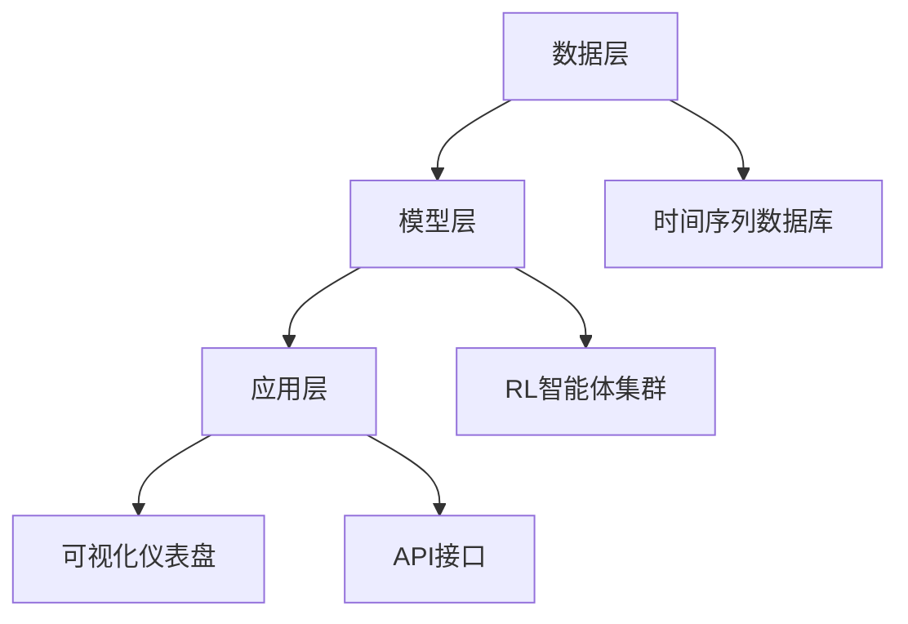

# 阿里巴巴ESG智能管家：强化学习赋能企业绿色可持续发展新篇章

## 引言  
随着全球对环境、社会和治理（ESG）问题的关注度不断提升，企业如何高效、精准地管理ESG数据并实现可持续发展目标，已成为行业面临的重大挑战。传统的ESG管理依赖人工报表和固定规则，难以适应复杂多变的业务场景。阿里巴巴近期推出的ESG智能化运营管理系统，通过引入强化学习（Reinforcement Learning, RL）技术，实现了企业级ESG管理流程的智能化和高效化，为绿色可持续发展开辟了新路径。本文将深入探讨该系统的技术原理、应用场景及其未来潜力。  

## 技术详解  
### 强化学习在ESG管理中的核心作用  
强化学习是一种通过智能体（Agent）与环境交互，通过试错学习最优策略的机器学习范式。在ESG管理中，RL的适用性体现在其能够动态优化决策，例如在能源消耗、碳排放控制等场景中，智能体可以根据实时数据调整策略，以最小化环境影响或最大化资源利用效率。  

阿里巴巴的ESG智能管家系统采用了基于多智能体强化学习（MARL）的架构，支持不同ESG子目标（如碳减排、供应链可持续性）的协同优化。其核心算法基于Deep Q-Network（DQN）的变种，结合了长期奖励机制，确保决策符合企业战略目标。以下是简化版的算法伪代码：  

```python
class ESGAgent:
    def __init__(self, state_dim, action_dim):
        self.q_network = DQN(state_dim, action_dim)
        self.target_network = DQN(state_dim, action_dim)
        self.memory = ReplayBuffer()
    
    def act(self, state):
        q_values = self.q_network(state)
        return np.argmax(q_values)
    
    def learn(self):
        state, action, reward, next_state, done = self.memory.sample()
        target = reward + gamma * np.max(self.target_network(next_state))
        loss = mse(self.q_network(state)[action], target)
        self.q_network.update(loss)
```  

### 系统架构与关键模块  
该系统的技术架构分为三层：数据层、模型层和应用层。数据层整合企业内外部ESG数据（如能耗、供应链碳足迹、员工多样性指标），通过时间序列数据库（如InfluxDB）存储。模型层包含多个RL智能体，每个智能体对应一个ESG优化子任务，例如：  
- **能源管理智能体**：通过动态调整服务器功耗和数据中心制冷策略，降低PUE（电源使用效率）。  
- **供应链碳足迹智能体**：根据供应商碳排放数据，优化采购决策。  

应用层提供可视化仪表盘和API接口，支持企业实时监控ESG绩效并生成合规报告。下图展示了系统架构：  



## 应用场景  
### 案例一：数据中心能源优化  
阿里巴巴的云数据中心采用ESG智能管家后，通过RL算法动态调整服务器负载和冷却系统运行模式。在测试环境中，系统通过以下策略降低能耗：  
1. 根据实时负载预测，动态分配计算资源；  
2. 结合室外温度数据，优化冷却系统启停时间。  
结果显示，系统将PUE从1.4降低至1.2，年节电率达15%。  

### 案例二：供应链可持续性管理  
某零售企业接入该系统后，智能体通过分析供应商的ESG评级、运输路线碳排放等数据，生成优化采购建议。例如，当检测到某供应商的碳足迹超标时，系统自动推荐替代供应商或调整订单比例。实际应用中，该企业供应链碳排放强度下降8%。  

### 挑战与解决方案  
实际部署中，ESG智能管家面临两大挑战：  
1. **数据稀疏性**：部分ESG数据（如微小供应商的碳数据）难以获取。解决方案是引入迁移学习，利用行业通用数据预训练模型。  
2. **奖励函数设计**：平衡短期成本与长期ESG目标。系统采用分层奖励机制，例如短期奖励为能耗节省，长期奖励为碳减排量。  

## 未来展望  
### 技术发展趋势  
1. **联邦学习与ESG数据隐私**：未来ESG智能管家可能采用联邦学习，在不共享原始数据的情况下，联合多个企业的RL模型训练，提升泛化能力。  
2. **可解释AI（XAI）**：通过注意力机制和决策树可视化，解释智能体的优化逻辑，增强企业对系统的信任。  
3. **多模态融合**：结合卫星遥感、物联网传感器等多源数据，提升ESG监测的实时性和准确性。  

### 行业影响  
ESG智能管家的成功实践可能推动以下变革：  
- **标准化ESG决策流程**：类似财务ERP系统，RL驱动的ESG管理工具可能成为企业标配。  
- **新兴职业需求**：ESG数据科学家、RL策略工程师等岗位将需求激增。  

## 总结  
阿里巴巴ESG智能管家通过强化学习技术，实现了ESG管理的智能化升级，为企业在环保、社会和治理方面的决策提供了科学依据。其核心技术包括多智能体RL、动态奖励机制和分层架构，已在数据中心节能、供应链优化等场景验证效果。未来，随着联邦学习、XAI等技术的融入，ESG智能管家有望成为企业可持续发展的核心引擎。对于技术从业者而言，这一领域既带来了挑战，也创造了巨大的创新空间。